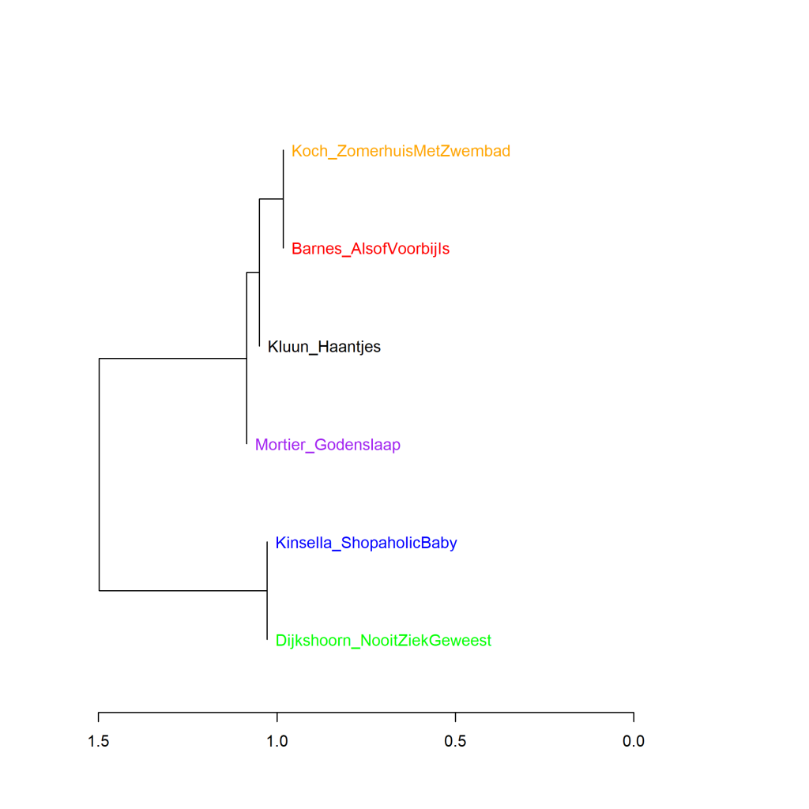

Kleurenversie van de grafiek op p. 210 van *Het raadsel literatuur*.

Kluun, *Haantjes*, versus Koch, *Zomerhuis met zwembad*, clusteranalyse (1000 meest frequente woorden).
Aangevuld met Barnes, *Alsof het voorbij is*, Kinsella, *Shopaholic en baby*, Dijkshoorn, *Nooit ziek geweest* en
Mortier, *Godenslaap*, clusteranalyse (1000 meest frequente woorden). Maat: Classic Delta.

### **Extra grafieken Kluun versus Koch**

Ook deze grafieken zijn gemaakt met het Stylo Package for R. Zie  Grafiek 4.5 voor meer informatie over het package en de verschillende maten.

In Grafiek 8.6, waarin de Nederlandse literaire romans met elkaar werden vergeleken, staat J.J. Voskuils *De buurman* eenzaam onderaan. In Grafiek 8.7 wordt nagegaan of *De buurman* (met een score voor literaire kwaliteit in de middencategorie) meer lijkt op een paar hoogliterair gevonden romans of juist op een paar van de romans die juist het minste literaire kwaliteit toegekend kregen. De romans van Kinsella en Dijkshoorn kregen lage scores en die van Mortier, Lanoye en Barnes ontvingen de drie hoogste scores.

In de clusteranalyse gevisualiseerd in Grafiek 8.7, gebaseerd op de 1000 meest frequente woorden, lijken de romans van de twee Vlaamse auteurs het meest op elkaar, en daarna die van Kinsella en Dijkshoorn, en clustert Voskuil met nummer 1 op literaire kwaliteit Barnes, en dit cluster lijkt het meest op de hoogliteraire Lanoye en Mortier. Als we echter een hele reeks van clusteranalyses doen, blijven er twee hoofdclusters over, de hoogliteraire Barnes, Lanoye en Mortier en is Voskuil terug te vinden bij de weinig literair gevonden Kinsella en Dijkshoorn. De analyse op hoofdcomponenten geeft wat meer diepte aan dit plaatje, zoals de visualisatie in Grafiek 8.7.2 toont: hier zien we Voskuil toch weer dichter bij Barnes.

**Grafiek 8.7.1 Kluun, *Haantjes*, versus Koch, *Zomerhuis met zwembad*. Aangevuld met Barnes, *Alsof het voorbij is*, Kinsella, *Shopaholic en baby*, Dijkshoorn, *Nooit ziek geweest* en Mortier, *Godenslaap*.**

Bootstrap consensus tree (**100** - **1000** meest frequente woorden, increment van 100, consensus strength 0.5). Maat: Classic Delta.

**Grafiek 8.7.2 Kluun, *Haantjes*, versus Koch, *Zomerhuis met zwembad*. Aangevuld met Barnes, *Alsof het voorbij is*, Kinsella, *Shopaholic en baby*, Dijkshoorn, *Nooit ziek geweest* en Mortier, *Godenslaap*.**

Analyse op hoofdcomponenten (**1000** meest frequente woorden). Maat: PCA, correlatieversie.

**Conclusie**

Ook voor de roman van Voskuil zijn de woordfrequenties niet goed te relateren aan de score voor literaire kwaliteit die het boek kreeg van de lezers. Afhankelijk van het vergelijkingmateriaal komt *De buurman* ofwel terecht bij de meest literaire romans, ofwel bij de minst literair gevonden boeken. We moeten dus verder kijken als we meer willen weten over wat een roman nu literair maakt. Meer hierover in *Het raadsel literatuur* op p. 208-210.

**Hoe zijn de metingen te repliceren?**

In het R Package (zie XXX) is voor alle 401 romans een woordfrequentielijst opgenomen met de 3000 meest gebruikte woorden per tekst. VOORBEELDQUERY HIER!
