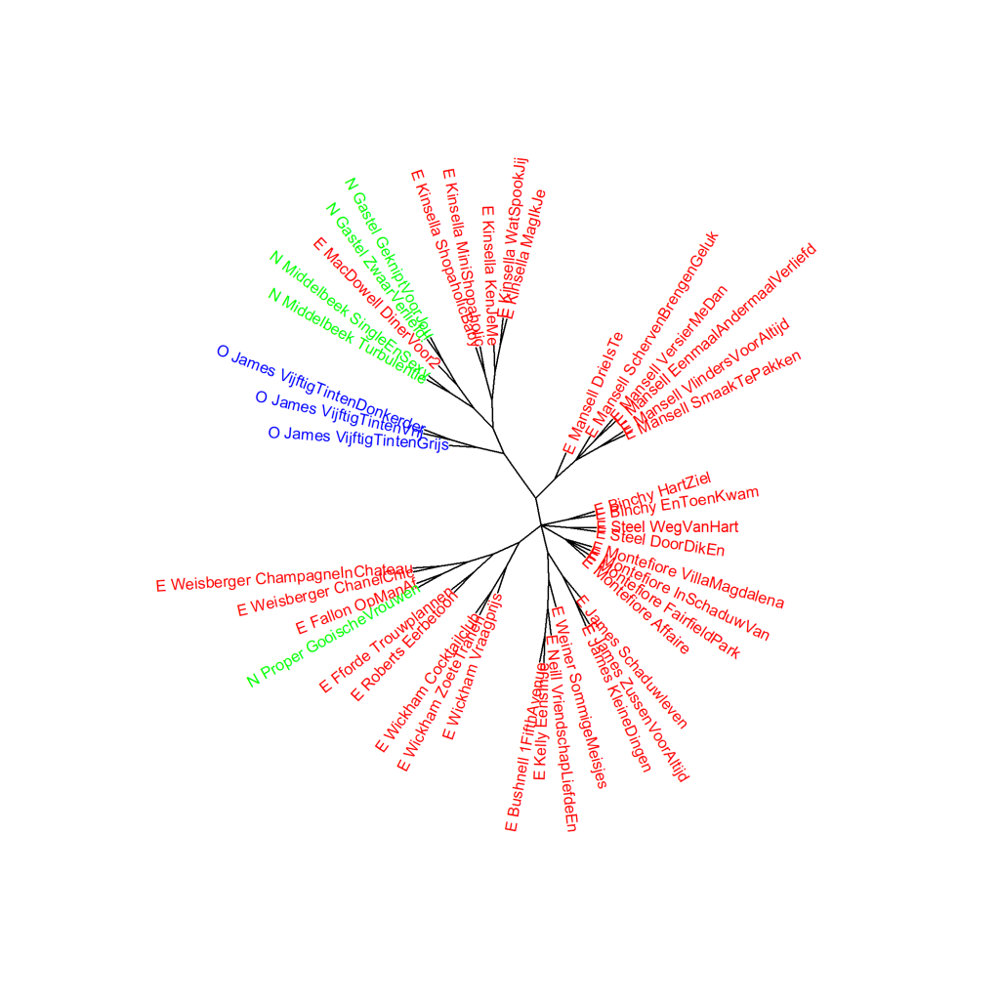

Kleurenversie van de grafiek op p. 245 van *Het raadsel literatuur*.

Vijftig tinten en Romantiek, analyse op hoofdcomponenten (1000 meest frequente woorden). Uit het Engels vertaalde romans staan weergegeven met een E_ voor de auteur en verkorte titel, en oorspronkelijk
Nederlandstalige romans zijn aangeduid met N_. De O_ voor de Vijftig tinten-trilogie staat voor Overig. Maat: PCA, correlatieversie.

### **Extra grafieken Vijftig tinten en Romantiek**

Ook deze grafieken zijn gemaakt met het Stylo Package for R. Zie  Grafiek 4.5 voor meer informatie over het package en de verschillende maten.

**Grafiek 9.2.1 Vijftig tinten en Romantiek**

Clusteranalyse (**1000** meest frequente woorden). Maat: Classic Delta.

Ook in de visualisatie van deze clusteranalyse is duidelijk te zien dat boeken van dezelfde auteur meestal het meest op elkaar lijken. Verder zijn er geen aparte takken voor romans die de hoogste of de laagste scores kregen voor literaire kwaliteit of die tot de middengroep behoorden.

**Grafiek 9.2.2 Vijftig tinten en Romantiek**

Bootstrap consensus tree (**100** - **1000** meest frequente woorden, increment van 100, consensus strength 0.5). Maat: Classic Delta.

**Conclusie**

De extra metingen bevestigen dat de *Vijftig tinten*-trilogie wat woordfrequenties niet overlapt met de boeken uit de categorie Romantiek in het onderzoekscorpus. Meer hierover in *Het raadsel literatuur* op p. 244-245.

**Hoe zijn de metingen te repliceren?**

In het R Package (zie XXX) is voor alle 401 romans een woordfrequentielijst opgenomen met de 3000 meest gebruikte woorden per tekst. VOORBEELDQUERY HIER!
